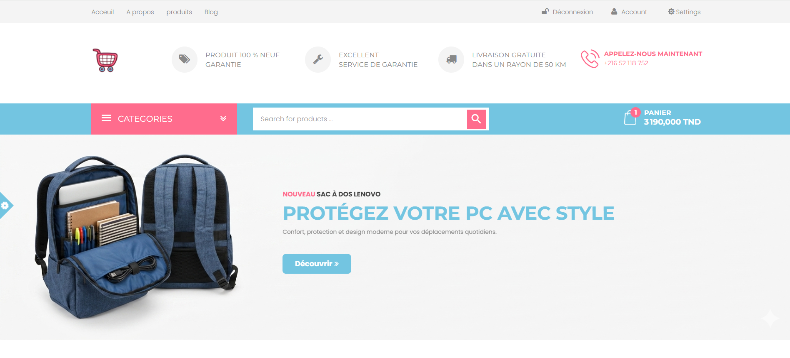
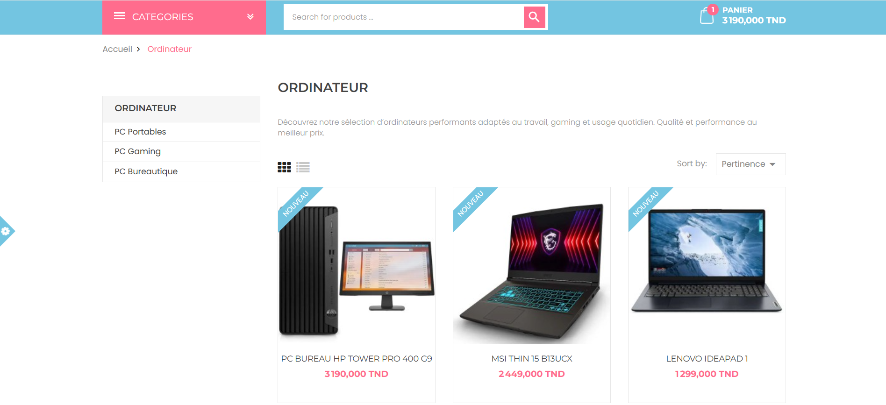
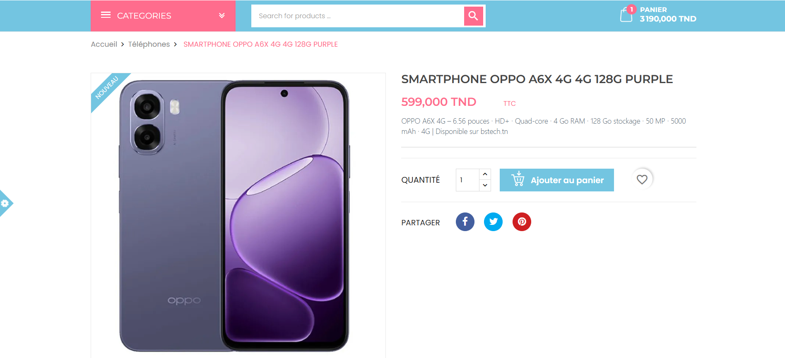
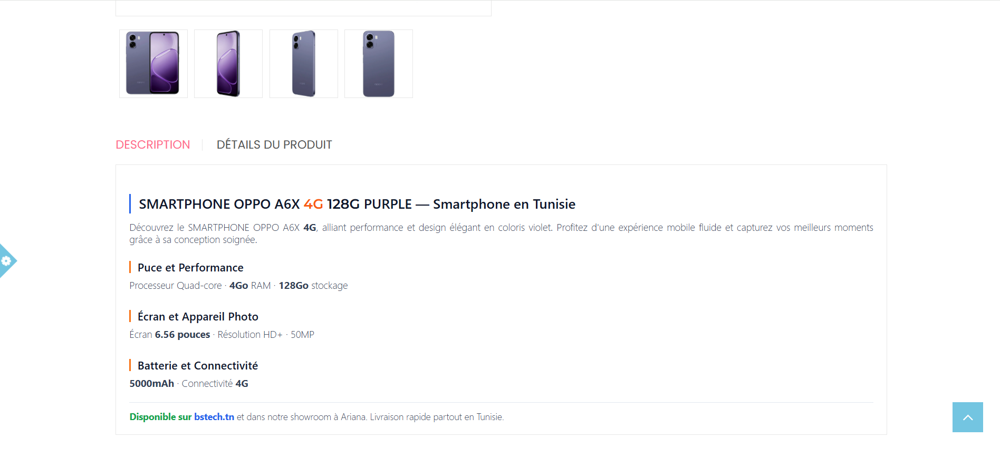
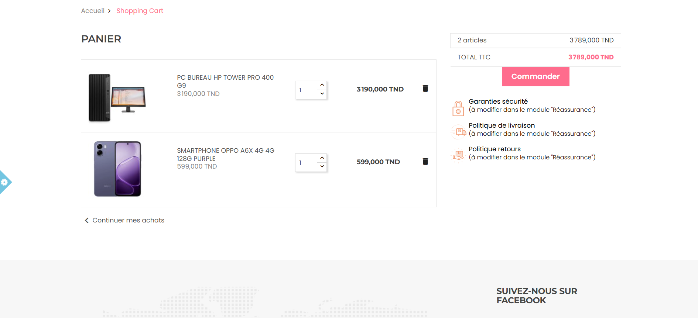
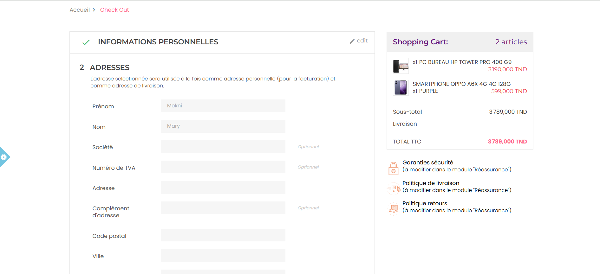
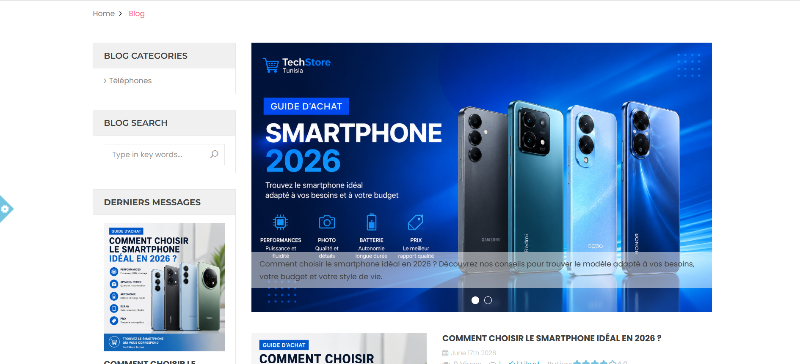

# 🛒 TechStore – Boutique E-commerce sous PrestaShop

## 📖 Présentation

**TechStore** est un projet e-commerce développé avec **PrestaShop 8**, simulant une boutique spécialisée dans la vente de matériel informatique et d'accessoires technologiques.

L'objectif principal de ce projet est d'approfondir la maîtrise de PrestaShop en personnalisant un thème, en configurant les modules, en organisant le catalogue produits et en comprenant l'architecture basée sur les hooks et les templates Smarty.

---

## 🎯 Objectifs du projet

- Découvrir l'architecture de PrestaShop
- Personnaliser un thème professionnel
- Configurer les modules du Back Office
- Comprendre le fonctionnement des Hooks
- Modifier les templates Smarty (.tpl)
- Adapter le design avec HTML, CSS et JavaScript
- Mettre en place un catalogue e-commerce complet

---

## 🛠 Technologies

| Technologie | Utilisation |
|-------------|-------------|
| PrestaShop 8 | CMS E-commerce |
| PHP | Backend |
| Smarty | Templates |
| HTML5 | Structure |
| CSS3 | Personnalisation du thème |
| JavaScript | Interactions |
| MySQL | Base de données |
| XAMPP | Environnement de développement |

---

## ✨ Fonctionnalités

- ✅ Page d'accueil personnalisée
- ✅ Navigation avec Mega Menu
- ✅ Catalogue de produits
- ✅ Pages catégories
- ✅ Fiche produit détaillée
- ✅ Panier
- ✅ Processus de commande (Checkout)
- ✅ Blog intégré
- ✅ Modules ETS-Soft configurés
- ✅ Design responsive

---

# 📸 Captures d'écran

## 🏠 Page d'accueil

---

## 📂 Page catégorie

---

## 📦 Catalogue des produits

---

## 🔍 Détail d'un produit

---

## 🛒 Panier

---

## 💳 Checkout

---

## 📰 Blog

---

## 📚 Compétences acquises

Au cours de ce projet, j'ai travaillé sur :

- Installation et configuration de PrestaShop
- Gestion du catalogue
- Création des catégories
- Configuration des modules
- Utilisation des Hooks (`displayHome`, `displayNav`, `displayHeader`, etc.)
- Personnalisation des templates Smarty
- Modification du design via CSS
- Compréhension de l'architecture d'un thème PrestaShop
- Gestion des positions des modules
- Personnalisation du Mega Menu

---

## 📬 Contact

N'hésitez pas à me contacter pour échanger autour du développement web et des solutions e-commerce.
